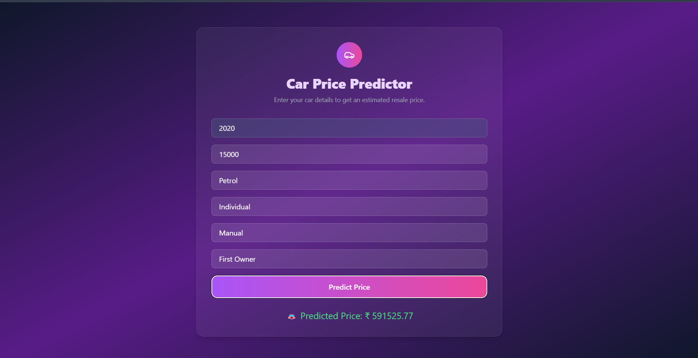

# Prise: Car and Gold Price Prediction Web App

**Prise** is a full-stack web application that leverages machine learning to predict car and gold prices based on user input. It features a responsive frontend built with HTML, Tailwind CSS, and vanilla JavaScript, and a Flask-powered backend that hosts two pre-trained ML models.

---

## 🚀 Live Demo

> **[Live Link (Render)](https://prise-1.onrender.com)** 

---

## 🖼️ Demo Image

Here’s a quick look at the UI of the Prise application:

### 🏠 1. Home Page


---

### 🚗 2. Car Prise


---

### 🪙 3. Gold Prise


---


---

## 📁 Folder Structure

```
Prise/
├── backend/                     # Flask backend and ML models
│   ├── static/                  # Static files (CSS, JS, images)
│   ├── templates/               # HTML templates (Jinja2)
│   ├── car_model.pkl            # Car price prediction model
│   ├── gold_model.pkl           # Gold price prediction model
│   ├── app.py                   # Flask application entry point
│   ├── requirements.txt         # Python dependencies
│   └── runtime.txt              # Python version for Render
├── README.md                    # This file
└── .gitignore                   # Git ignored files
```

---

## 🧠 Features

* 🔮 Predict **car prices** based on input like fuel type, seller type, etc.
* 🪙 Predict **gold prices** based on historical or synthetic data features.
* 🎨 Responsive, minimal, and modern UI using Tailwind CSS.
* ⚙️ Two separate ML models served via Flask.
* ☁️ Deploy-ready on **Render** with proper dependency management.

---

## 🛠️ Technologies Used

### Frontend:

* HTML5
* Tailwind CSS
* JavaScript

### Backend:

* Python
* Flask
* scikit-learn (for model loading)
* Jinja2 (templating)

### Deployment:

* Render (for full-stack hosting)

---

## 📦 Setup Instructions

### 1. Clone the Repository

```bash
git clone https://github.com/Shrishkd/Prise.git
cd Prise/backend
```

### 2. Create Virtual Environment and Install Dependencies

```bash
python -m venv venv
source venv/bin/activate  # Windows: venv\Scripts\activate
pip install -r requirements.txt
```

### 3. Run Locally

```bash
python app.py
```

Then open [http://localhost:5000](http://localhost:5000) in your browser.

### 4. Deploy on Render

* Push the code to GitHub.
* Create a new **Web Service** on Render.
* Set:

  * **Build Command**: *Leave blank*
  * **Start Command**: `python app.py`
  * **Environment**: Python 3.10 (as in `runtime.txt`)
* Connect your repo and deploy.

---

## 🧪 Sample Inputs

### Car Price Prediction:

* Fuel: Petrol
* Seller Type: Individual
* Year: 2015
* KM Driven: 45000

### Gold Price Prediction:

* Feature 1: 100
* Feature 2: 2.5
* ... *(based on model training features)*

---

## 🧑‍💻 Author

**Shrish Kumar Dubey**
B.Tech CSE (AI/ML) Student @ VIT Bhopal
🔗 [LinkedIn](https://www.linkedin.com/in/shrishkd/) | 🐙 [GitHub](https://github.com/Shrishkd)

---

## 📃 License

This project is open-source and available under the [MIT License](LICENSE).

---

## 💡 Future Enhancements

* Integrate more detailed feature selection for better predictions.
* Add login/signup functionality.
* Host frontend separately for better performance.
* Implement input validations and error handling.
* Add analytics dashboard to visualize predictions.

---

If you like this project, give it a ⭐ on GitHub and share your feedback!
